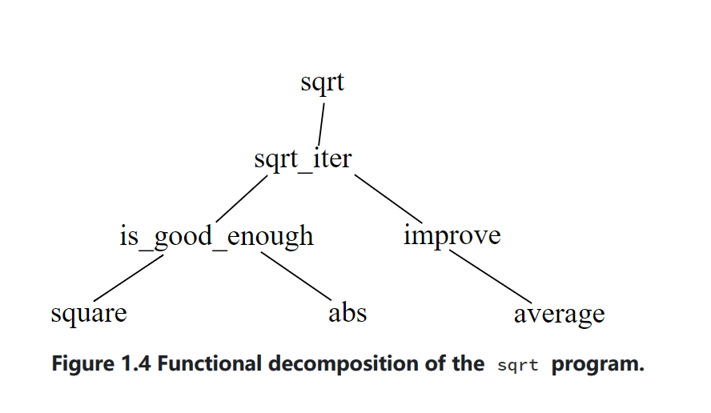

## 1.1 The Elements of Programming
when describing a language, we should pay particular attentions to the means that the language provides for combing simple ideas to form more complex ideas.
Every powerful language has three mechanisms for accomplishing this:
1. **primitive expressions**, represent the simplest entities the language is concerned with.
2. **means of combination**, by which compound elements are built from simpler ones.
3. **means of abstraction**, by which compound elements can be named and manipulated as units.

In programming we deal with two kinds of elements: data and function.(in fact, they are really not so distinct).
* data: "stuff" that we want to manipulate.
* function: descriptions of the rules for manipulating data.

### 1.1.1 Expressions
expressions, statements, combinations. the value of an operator combination is obtained by applying the "function" specified by the operator to the args(values of the operands).

### 1.1.2 Naming and Environment
a critical aspect of a programming language is the means it provides for using names to refer to computational objects. such as CONSTANT, we say the name identifies a constant whose VALUE is the object.

constant declaration is our simplest means of abstraction, for it allows us to use simple name to refer to results of compound operations.

also, the interpreter must maintain some memory that tracking name-to-value pairs. this memory are called Environment(more precisely the program environment).

### 1.1.3 Evaluating Operator Combinations

### 1.1.4 Compound Functions
function declaration, a much more powerful abstraction technique by which a compound operation can be given a name and then refer to as a unit.
function applications are the second kind of combination of expressions into larger expressions we encounter: *function-expression(argument-expressions)*

### 1.1.5 The Substitution Model for Function Application
* the purpose of the substitution is to help us think about function application, not how interpreter works.
* we will present a sequence of increasingly elaborate models of how interpreters work.

### 1.1.6 Conditional Expressions and Predicates

### 1.1.7  Example: Square Roots by Newton's Method

### 1.1.8   Functions as Black-Box Abstractions
the entire *sqrt* program can be viewed as a cluster of functions that mirrors the decomposition of the problem into subproblem.

the importance of this decomposition strategy is not simply dividing the program into parts.***Rather, it is crucial that each function accomplishes an identifiable task that can be used as a module in defining other functions***.

For example, when we define the *is_good_enough* function in terms of *square*, we are able to regard the square function as a "black box." Indeed, as far as the *is_good_enough* function is concerned, *square* is not quite a function but rather an abstraction of a function, a so-called *functional abstraction*. At this level of abstraction, any function that computes the square is equally good.
#### Local names
the meaning of a function should be independent of the parameter names used by its author

#### Internal declarations and block structure
use block structure extensively to help us break up large programs into tractable pieces