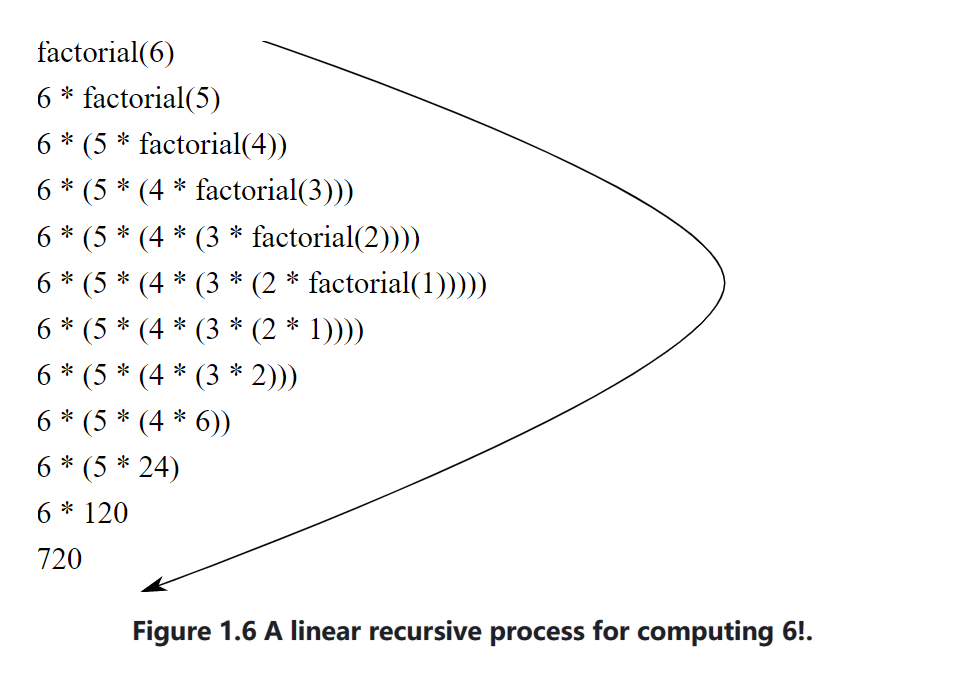
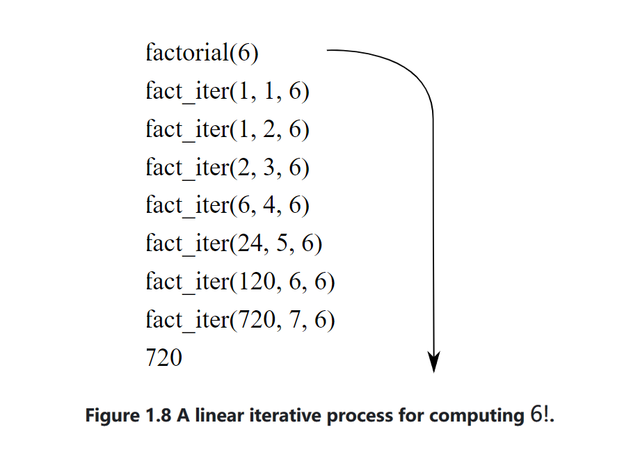
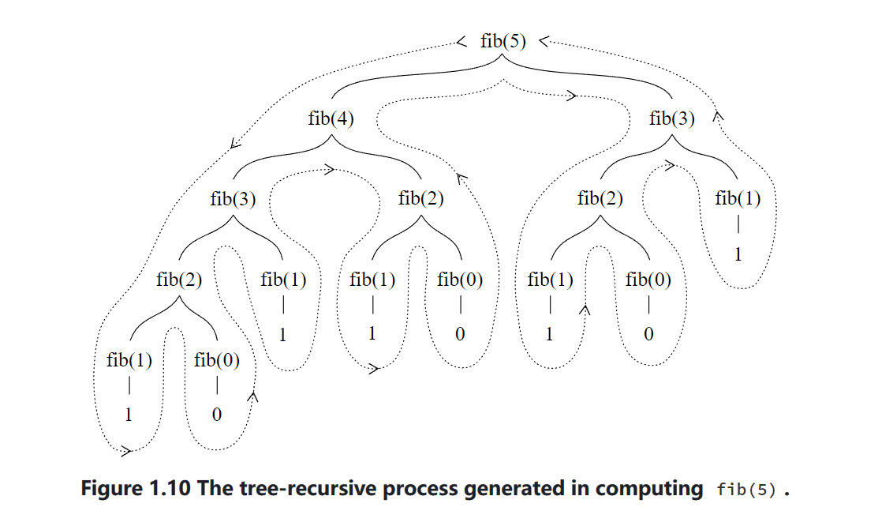

## 1.2 Functions and the Processes They Generate
a function is a pattern for the *local evolution* of a computational process.it specifies how each stage of the process is build upon the previous stage.

we will examine some common "shapes" for processes generated by simple functions. We will also investigate the rates at which these processes consume the important computational resources of time and space. 

### 1.2.1 Linear Recursion and Iteration
giving computing factorials:    *n! = n⋅(n−1)⋅(n−2)⋯3⋅2⋅1*
​
we could write this function:
```javascript
function factorial(n) {
    return n === 1 
           ? 1
           : n * factorial(n - 1);
}
```
take a different perspective on it. we could describe a rule for computing *n!* by specifying that we first multiply 1 by2, then multiply the result by 3, then by 4, until we reach n.We can describe the computation by saying that the counter and the product simultaneously change from one step to the next according to the rule:
```
product ← counter⋅product
counter ← counter+1
```
```javascript
function factorial(n) {
    return fact_iter(1, 1, n);
}
function fact_iter(product, counter, max_count) {
    return counter > max_count
           ? product
           : fact_iter(counter * product,
                       counter + 1,
                       max_count);
} 
```
Both compute the same mathematical function on the same domain, and each requires a number of steps proportional to *n* to compute *n!*.

when we consider the "shapes" of the two processes, we find that they evolve quite differently.



The expansion occurs as the process builds up a chain of deferred operations (a chain of multiplications). The contraction occurs as the operations are actually performed. This type of process, characterized by a chain of **deferred operations**, is called a ***recursive process***. Carrying out this process requires that the interpreter keep track of the operations to be performed later on.



the second process does not grow and shrink.We call this an ***iterative process***. In general, an iterative process is one whose state can be summarized by a fixed number of ***state variables***, together with a fixed rule that describes how the state variables should be updated as the process moves from state to state and an (optional) end test that specifies conditions under which the process should terminate.

In the iterative case, the state variables provide a complete description of the state of the process at any point. Not so with the recursive process. In this case there is some additional "hidden" information, maintained by the interpreter and not contained in the state variables.

**we must be careful not to confuse the notion of a recursive process with the notion of a recursive function.** a recursive function such as *fact_iter* generates an iterative process. However, the process really is iterative: Its state is captured completely by its three state variables, and an interpreter need keep track of only three names in order to execute the process.

### 1.2.2 Tree Recursion
Another common pattern of computation is called tree recursion. consider computing the sequence of Fibonacci numbers:
```javascript
function fib(n) {
    return n === 0
           ? 0
           : n === 1
           ? 1
           : fib(n - 1) + fib(n - 2);
} 
```


In general, the evolved process looks like a tree, notice that the branches split into two at each level (except at the bottom).

We can also formulate an iterative process for computing the Fibonacci numbers. it is a linear iteration.
```javascript
function fib(n) {
    return fib_iter(1, 0, n);
}
function fib_iter(a, b, count) {
    return count === 0
           ? b
           : fib_iter(a + b, a, count - 1);
} 
```
although the first *fib* function is much less efficient than the second one, it is more straightforward, being little more than a translation into JavaScript of the definition of the Fibonacci sequence. To formulate the iterative algorithm required noticing that the computation could be recast as an iteration with three state variables.


#### Example: Counting change


### 1.2.3 Orders of Growth
### 1.2.4 Exponentiation
### 1.2.5  Greatest Common Divisors